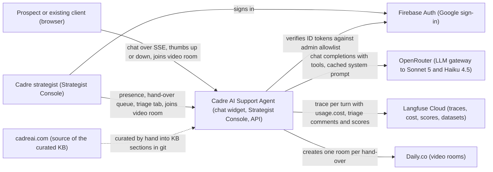
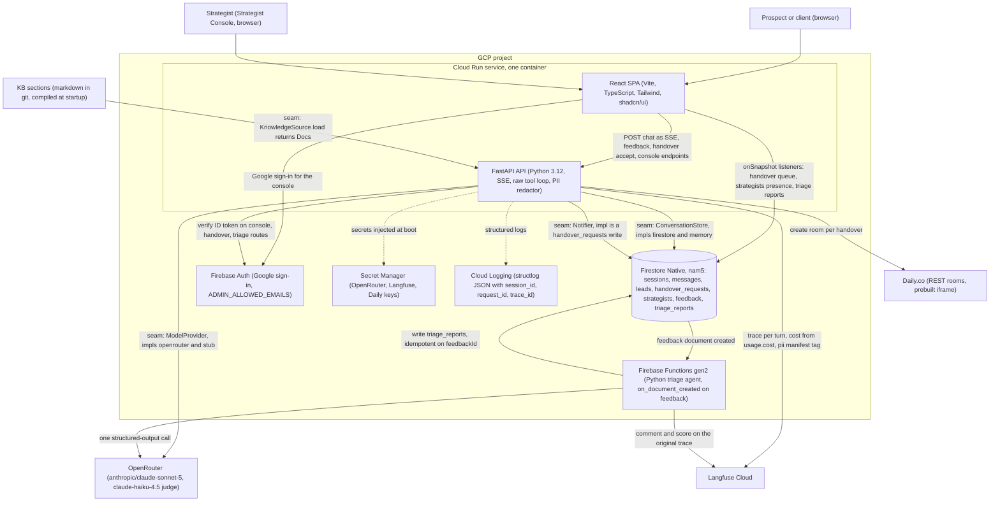
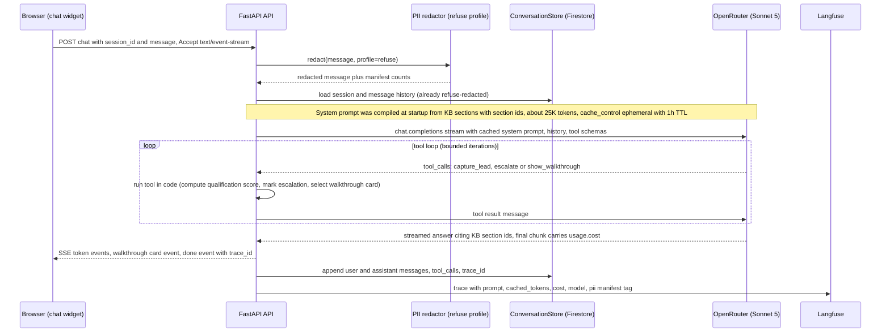
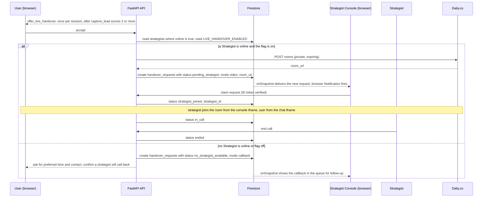
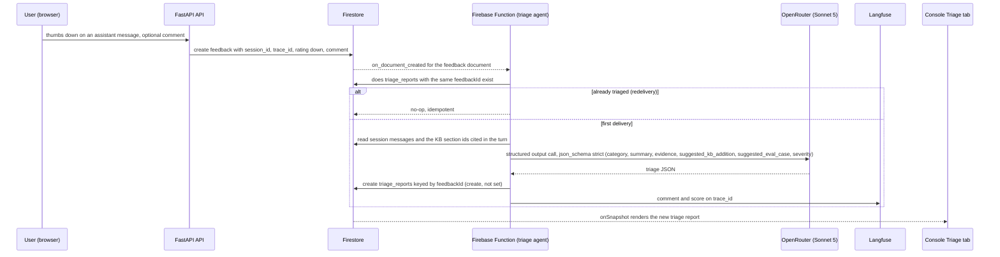
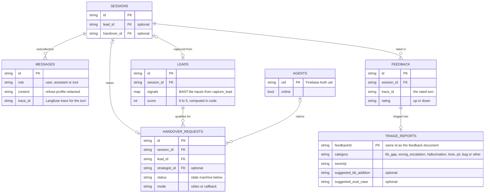
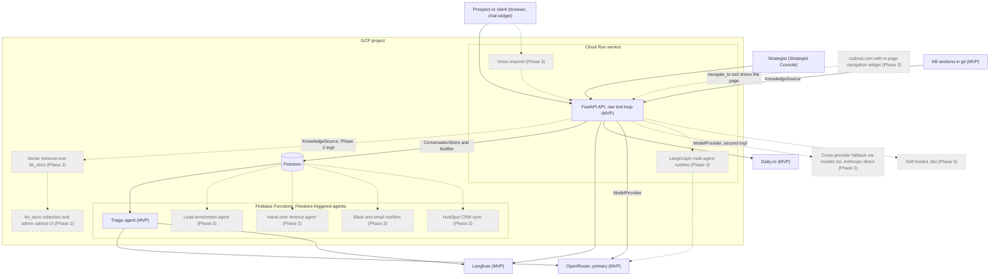

# Architecture

MVP design for the Cadre AI support agent, as settled on 2026-08-30. Each numbered decision links to an ADR in `adr/`. Diagrams are Mermaid and render on GitHub.

## 1. Overview

- **What it is.** A customer-support agent for Cadre AI: an anonymous chat widget for prospects and existing clients, plus an authenticated Strategist Console for Cadre strategists.
- **MVP triad.** (1) Grounded Q&A over a curated knowledge base with honest escalation; (2) lead qualification and human hand-over, callback path first and live video when a strategist is online; (3) observability: a trace with cost for every turn, user feedback, and an eval suite that gates changes.
- **Shape.** One Cloud Run container serves the FastAPI API and the built React SPA. Firestore holds sessions, leads, handover requests and feedback, and doubles as the event bus; a Firebase Function (Python) runs the triage agent on feedback events. OpenRouter is the only model provider at runtime, Langfuse records every turn, Daily.co hosts the video rooms.
- **Stateless by construction.** No agent state lives in a process. Each turn reloads the session from Firestore, so any instance can serve any turn and scale-to-zero is free.
- **Vocabulary.** A *session* is one anonymous chat. A *KB section* is the cited unit of the knowledge base. *Escalation* means the bot redirects to the contact form, email or phone because the KB does not answer; *hand-over* means a *Strategist* takes the conversation, by video or callback. A *lead* and its *qualification score* come from the `capture_lead` tool; a *handover request* is the Firestore record that drives the console. A *walkthrough card* is a rendered step-by-step card for portal tasks. *Feedback* becomes a *triage report* through the self-improvement loop. A *seam* is a tested interface with one production implementation and one *stub provider* (or in-memory store) for tests and CI.

## 2. Context diagram

## 3. Container diagram

The four seams are the only places a second implementation is allowed to appear. Each ships with one production implementation and one test implementation (stub provider, in-memory store); portability claims stop there.

## 4. Sequence diagrams

### 4a. One chat turn

The refuse profile runs before the model and before storage, so nothing in Firestore or in the prompt carries payment cards, government IDs or credentials. The full profile (emails and phones tokenised as well) applies only to traces, logs and notification free text; lead typed fields stay raw because the product needs them.

### 4b. Hand-over to a strategist

### 4c. Thumbs-down to triage report

The chat API never learns that the triage agent exists. Firestore is the event bus, and the same trigger pattern hosts future agents (lead enrichment, hand-over timeout) without touching the request path.

## 5. Data model

Not drawn: every document carries `created_at`; `sessions` also `last_seen` and `turn_count`; `messages` an optional `tool_calls` array; `leads` hold the raw typed contact fields `name`, `email`, `phone`, `company`, `role`, `industry` (all optional); `handover_requests` keep an optional `room_url` and a `timestamps` map with one entry per transition; `strategists` carry `email` and `updated_at`; `feedback` an optional refuse-redacted `comment`; `triage_reports` a `summary`, an `evidence` list and the `model` used. Phase 2 adds a `kb_docs` collection behind the `KnowledgeSource` seam; nothing else changes.

### Handover state machine

| From | Event | To | Notes |
| --- | --- | --- | --- |
| (none) | qualification score reaches 3, offer not yet made | `offered` | Offer is made once per session |
| `offered` | user accepts | `accepted_by_user` | |
| `offered` | user declines or ignores | `declined` | Terminal; bot continues in text |
| `accepted_by_user` | a Strategist is `online` and `LIVE_HANDOVER_ENABLED` is on | `pending_strategist` | Daily room created, `mode: video`, request written, console notified |
| `accepted_by_user` | no Strategist is online or flag off | `no_strategist_available` | Terminal; `mode: callback`, contact and preferred time captured on the lead |
| `pending_strategist` | Strategist claims the request in the console | `strategist_joined` | `strategist_id` set |
| `pending_strategist` | nobody claims within the timeout | `no_strategist_available` | Timeout agent is Phase 2; MVP shows the request until claimed |
| `strategist_joined` | both parties are in the room | `in_call` | |
| `in_call` | either side ends the call | `ended` | Terminal; every transition stamps `timestamps` |

## 6. Vision diagram

Solid boxes are MVP; grey dashed boxes are Phase 2 (triggered upgrades) and Phase 3 (platform vision). Triggers are recorded in the ADRs: vector retrieval when the KB passes roughly 50 pages or non-engineers edit it; LangGraph when a second agent or a durable multi-step workflow appears; Jitsi when video minutes make self-hosting cheaper than Daily.co.

## 7. Tech stack reference

| Component | Technology | Why | Alternative considered | ADR |
| --- | --- | --- | --- | --- |
| Knowledge base | Markdown KB sections in git, compiled into a prompt-cached system prompt with section ids | Small corpus, citations by section id, no retrieval failure mode | Bedrock Knowledge Base, Firestore vector search, Firecrawl ingestion | [0001](adr/0001-kb-in-prompt-no-rag.md) |
| LLM access | OpenRouter, default `anthropic/claude-sonnet-5`, judge `claude-haiku-4.5` | Cadre supplied the key, model switch by env var, `usage.cost` per request, Anthropic caching passes through | Anthropic direct (Phase 2 impl), Bedrock, Vertex | [0002](adr/0002-openrouter-sole-provider.md) |
| Hosting | Cloud Run, one container (FastAPI plus built SPA) | SSE, request concurrency, scale-to-zero | AWS App Runner, Lambda, Vercel | [0003](adr/0003-gcp-with-seams.md) |
| Database | Firestore Native (nam5) | Realtime listeners for the console, document triggers as event bus | Postgres on Cloud SQL | [0003](adr/0003-gcp-with-seams.md) |
| Runtime API | FastAPI, Python 3.12, uv | Same ecosystem as evals and the PII redactor, native SSE | Next.js API routes | [0003](adr/0003-gcp-with-seams.md) |
| Web | React, Vite, TypeScript, Tailwind, shadcn/ui, Cadre brand tokens | Fast to build, embeddable widget later | Flutter web | [0003](adr/0003-gcp-with-seams.md) |
| Agent runtime | Raw tool loop, single agent, five tools | Full feature access, every line understood | PydanticAI, LangGraph, Google ADK, Bedrock AgentCore | [0004](adr/0004-raw-tool-loop.md) |
| Async agents | Firebase Functions gen2 (Python), Firestore `on_document_created` | Events decoded for you, request path unaware of consumers | FastAPI BackgroundTasks, Eventarc to Cloud Run, Pub/Sub | [0005](adr/0005-event-driven-triage-agent.md) |
| PII handling | Deterministic redactor with `refuse` and `full` profiles | Cards, IDs and credentials never reach the model or storage; contacts still usable for leads | Model-based redaction only | [0006](adr/0006-two-profile-pii.md) |
| Video hand-over | Daily.co prebuilt iframe, room per handover via REST | No login for either side | Jitsi (self-hosted vision target), JaaS | [0007](adr/0007-daily-video-handover.md) |
| Evals | pytest plus JSONL cases, Haiku judge, results to Langfuse datasets | No retrieval, so retrieval metrics do not apply | RAGAS | [0008](adr/0008-pytest-evals-over-ragas.md) |
| Qualification | BANT-lite score 0 to 5 computed in code from `capture_lead` arguments | Deterministic, testable threshold for the hand-over offer | Intent-only, offer after N turns | [0009](adr/0009-bant-lite-qualification.md) |
| Console auth | Firebase Auth Google sign-in plus email allowlist, ID token verified server-side | Preference, allowlist is enough for a handful of strategists | Identity Platform, own JWT, shared token (fallback only) | [0010](adr/0010-firebase-auth-console.md) |
| Observability | Langfuse Cloud | Open source, cost from `usage.cost`, sessions, datasets, scores | LangSmith, Traceloop | [0002](adr/0002-openrouter-sole-provider.md) |
| Logs and secrets | structlog JSON to Cloud Logging; Secret Manager injected into Cloud Run | Correlate session_id, request_id and trace_id; no secrets in the image or repo | Plain logging; env vars in the service config | [0003](adr/0003-gcp-with-seams.md) |
| CI | GitHub Actions on pull requests: lint, unit tests, stub-provider eval subset | Deterministic, zero model spend on PRs | Cloud Build | [0008](adr/0008-pytest-evals-over-ragas.md) |

## 8. Capacity model

`parallel_conversations ≈ min(instances × concurrency, provider_TPM ÷ tokens_per_turn)`. The left term is the app layer, the right term is the model provider. Only uncached input tokens count toward `tokens_per_turn` for rate limiting: Anthropic documents that cache-read tokens do not count toward input TPM, and OpenRouter passes Anthropic caching through unchanged.

**Cost per turn, Sonnet 5 via OpenRouter.**

| Item | Tokens | Price per M | Cost |
| --- | --- | --- | --- |
| System prompt, cache read | 25,000 | $0.20 | $0.0050 |
| History plus new message, uncached input | ~2,000 | $2.00 | $0.0040 |
| Output | ~300 | $10.00 | $0.0030 |
| **Per turn** | | | **≈ $0.012 (1.2¢)** |
| **Per 6-turn conversation** | | | **≈ $0.072 (7¢)** |
| Cache write, 1h TTL | 25,000 | $4.00 | $0.10, at most once per active hour |

Without caching the same turn costs about 5.7¢, so caching removes roughly 80% of per-turn spend and the same share of rate-limited input tokens. Each extra tool-loop iteration re-reads the cache and adds about 0.5¢. The 1h TTL was chosen over the 5-minute default (write $2.50/M) so continuous traffic pays one write per hour instead of one per idle gap.

**Worked table.** Assumptions: Cloud Run default concurrency of 80 requests per instance (each open SSE stream is one request); about 2,300 uncached input tokens per turn including tool round-trips; an active conversation issues at most two turns per minute. Provider tiers are illustrative, since OpenRouter does not publish numeric limits for paid keys.

| Cloud Run instances | App-layer ceiling (instances × 80) | Provider ceiling at 400K input TPM | Provider ceiling at 2M input TPM | Binding constraint |
| --- | --- | --- | --- | --- |
| 1 | 80 streams | ≈ 87 conversations (174 turns/min) | ≈ 435 conversations (870 turns/min) | app layer |
| 5 | 400 streams | ≈ 87 | ≈ 435 | provider tier |
| 10 | 800 streams | ≈ 87 | ≈ 435 | provider tier |

**Burst mitigations.** At 174 turns per minute the spend is about $125 per hour, at 870 about $625; the provider rate-limit tier is the real ceiling in every row past the first, and it is a commercial setting rather than an engineering one. A per-session turn cap (surfaced as an escalation with the contact channels) bounds what one visitor can consume. On a provider 429 the API retries with backoff while the widget shows a queue state rather than an error. Degraded mode switches `MODEL` to `anthropic/claude-haiku-4.5` by env var, half the price and a different upstream bucket, with no code deploy.

**Why no live load test.** None is planned. Driving hundreds of turns through OpenRouter measures the rate-limit tier of Cadre's key, a billing setting that changes with a support ticket, and burns credits to learn it. The questions the app layer owns (SSE fan-out, one Firestore round-trip per turn, tool-loop bounds) are checked with a 200-VU smoke test against the stub provider, which proves the API is not the bottleneck below the provider ceiling at zero model spend.

## 9. Scaling trade-offs

- **Stateless API.** Any instance serves any turn and scale-to-zero costs nothing; the price is one Firestore read of the session history per turn. Phase 2: cap history length and summarise older turns.
- **Firestore as event bus.** No broker to run and the request path never learns about consumers, but delivery is at-least-once, so every consumer is idempotent on the source document id. Phase 2: Pub/Sub only when fan-out or ordering is needed.
- **Prompt caching as the scale lever.** The 25K-token system prompt costs $0.20/M instead of $2/M and stops counting toward TPM, a 10x lever on the binding constraint; it requires a byte-stable prompt, so nothing per-session may precede the cache breakpoint.
- **First bottleneck: provider TPM.** Appears at a few dozen parallel conversations on a low tier. Mitigations above; Phase 2 adds the `models` fallback list and an Anthropic-direct `ModelProvider` with its own rate-limit bucket.
- **Second bottleneck: open SSE streams.** Cloud Run counts each stream against concurrency and the request timeout. Phase 2: raise concurrency after the smoke test, keep one minimum instance to avoid cold starts on the first prospect, serve the SPA from a CDN so the container only serves streams.
- **Third bottleneck: KB size.** In-prompt KB scales to roughly 50 pages before cost, latency and attention degrade. Phase 2: Firestore-backed KB with vector retrieval behind the `KnowledgeSource` seam, cache hit rate preserved by compiling deterministically.
- **Console realtime listeners** are fine for a handful of Strategists watching one queue. Phase 2: filter listeners by team and paginate triage reports.
- **Triage cost is bounded by feedback volume, not traffic.** One Sonnet 5 call per thumbs-down. Phase 2: per-session feedback rate limit and trace sampling in Langfuse for up-rated turns.
- **Video concurrency is limited by online strategists, not infrastructure.** Daily.co bills per participant-minute; Jitsi self-hosting becomes worth it only at sustained volume. Single region (Firestore nam5, one Cloud Run region) stays until a client requires otherwise, since model latency dominates the hop.
- **Lock-in is accepted, portability is tested at the seams.** Second production implementations are Phase 2 work and are not claimed until they exist and pass the same eval suite.
